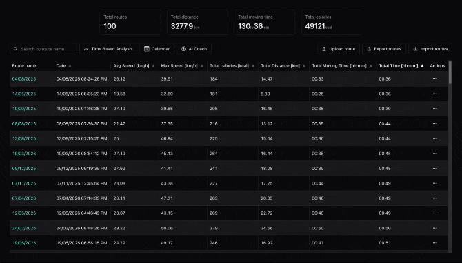
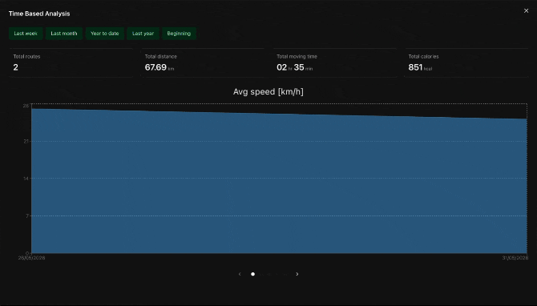
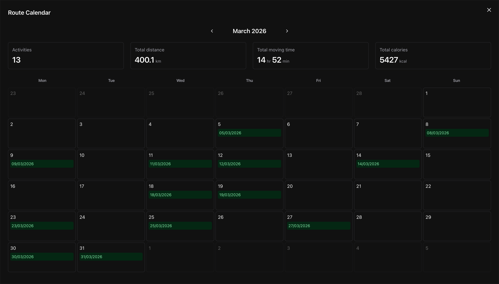
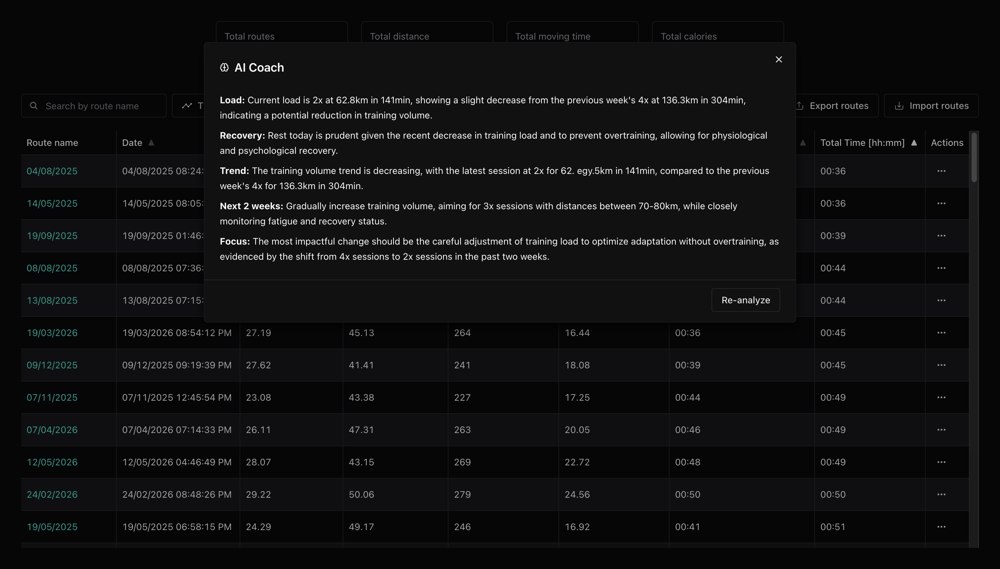

# FIT File Viewer

A browser-based tool to visualize and analyze cycling routes from `.fit` files — built out of frustration with a $30 GPS and a sync app that never worked.

**[→ Live demo](https://bike-routes.vercel.app/)**

## The problem

The Van Rysel [GPS100](https://support.decathlon.co.uk/van-rysel-gps-100) is a cheap (~$30 USD) bike GPS that records basic data: the route, avg speed, moving time, max speed, etc. The issue is Decathlon Connect, its companion app, which never reliably synced the device. Routes were stuck on the device.

Buying a more expensive GPS for my use case just to fix a software problem felt wrong. So I vibe coded this instead.

## View routes


## View stats


## Calendar


## AI Coach


---

## What it does

Plug your GPS into your laptop, open the app, upload the `.fit` file and the app will show the new added route. No account, no sync, no third party receives your data.

**Route library**
- Table view of all your rides with sortable columns: date, avg speed, max speed, distance, moving time, total time, calories
- Search by route name
- Click any route to open an interactive full-screen map

**Stats dashboard**
- Totals across all routes: distance, moving time, calories, number of rides

**Analysis views**
- Time-based analysis: slice your data by any date range
- Calendar view: see your rides laid out by month

**AI Coach** *(runs entirely in your browser)*
- Powered by [WebLLM](https://webllm.mlc.ai/) — the model downloads once and runs locally
- Analyzes your last 8 weeks of training data and gives structured feedback on load, recovery, trend, and next steps
- Zero API calls, zero data leaves your machine
- Currently uses **Phi-3.5-mini-instruct** (~2.3 GB, cached in the browser after the first download). You can swap it for any [WebLLM-supported model](https://github.com/mlc-ai/web-llm?tab=readme-ov-file#built-in-models) by changing the `MODEL_ID` constant in [`src/components/AICoachDialog.jsx`](src/components/AICoachDialog.jsx)

**Data management**
- Export all routes to a `.json` backup file
- Import from a previous backup
- Share any route as an image
- Rename or delete individual routes

## Privacy

Everything is stored in your browser's IndexedDB. Nothing is sent to any server. The app itself is a static site.

## Tech stack

- React + Vite
- Chakra UI
- Leaflet (maps)
- [fit-file-parser](https://github.com/jimmykane/fit-parser)
- WebLLM (in-browser AI)

## Run locally

```bash
npm install
npm run dev
```

## Contributing

PRs are welcome. The stack is React + Vite, so the setup is straightforward:

```bash
npm install
npm run dev
```

A few pointers to get oriented:

- **Route data** is read from `.fit` files in [`src/utils/fitParser.js`](src/utils/fitParser.js) and persisted to IndexedDB via [`src/utils/routeStorage.js`](src/utils/routeStorage.js)
- **Main table and actions** live in [`src/App.jsx`](src/App.jsx)
- **Map view** is in [`src/components/Map.jsx`](src/components/Map.jsx) (Leaflet)
- **AI Coach logic** — the model setup is in [`src/components/AICoachDialog.jsx`](src/components/AICoachDialog.jsx) and the prompt is built in [`src/utils/trainingAnalyzer.js`](src/utils/trainingAnalyzer.js)
- **Analysis dialogs** (time-based and calendar) are in [`src/components/`](src/components/)

## Compatibility

Built and tested with the Van Rysel GPS100. Should work with any device that exports standard `.fit` files (Garmin, Wahoo, etc.), but not extensively tested across devices.

## License

[MIT](LICENSE)
